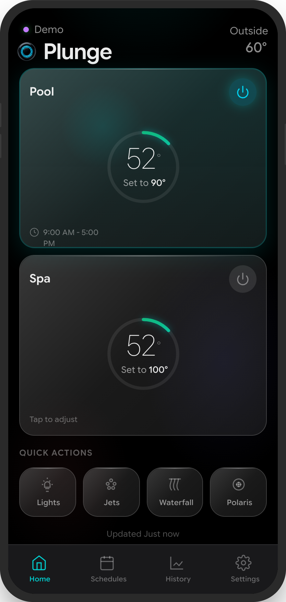
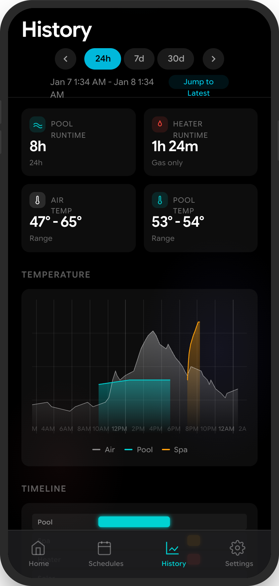
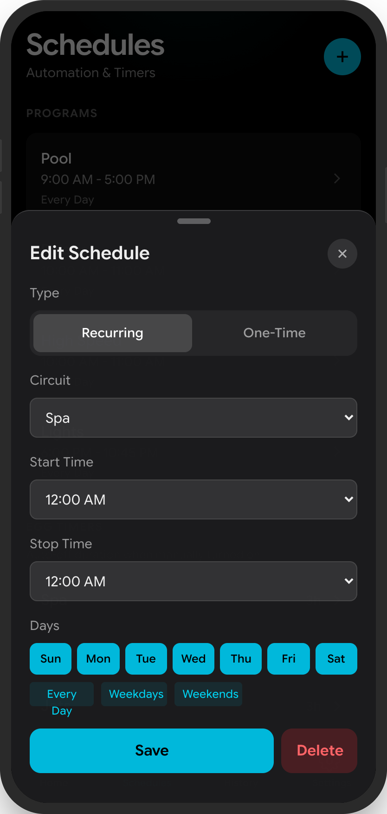

<p align="center">
  
</p>

<h1 align="center">Plunge</h1>

<p align="center">
  A modern, mobile-first web app for controlling Pentair ScreenLogic / IntelliCenter pool systems.
</p>

<p align="center">
  <strong><a href="https://plunge.sh">Try the live demo at plunge.sh</a></strong>
</p>


<p align="center">
  
  
  
  
</p>

## Features

- **Pool & Spa Control** - Toggle circuits, adjust temperatures, and set heat modes
- **Temperature Management** - View current temps, set points, and heat status with visual temp rings
- **Circuit Control** - Manage all pool circuits including lights, pumps, jets, and more
- **Light Control** - IntelliBrite color selection and light show modes
- **Schedules** - View and manage pool/spa schedules
- **History** - Browse temperature and equipment history with date navigation
- **Pump Settings** - Monitor pump status, RPM, watts, and configure high-speed override
- **Circuit Configuration** - Edit circuit names, functions, interfaces, and freeze protection
- **Egg Timer** - Quick run times for circuits (15min, 30min, 1hr, 2hr)

## Tech Stack

- **Framework**: [Next.js 16](https://nextjs.org/) with App Router
- **UI**: [React 19](https://react.dev/) + [Tailwind CSS 4](https://tailwindcss.com/)
- **Pool Protocol**: [node-screenlogic](https://github.com/parnic/node-screenlogic) v2.1.1
- **Language**: TypeScript 5

### node-screenlogic

This app uses the excellent [node-screenlogic](https://github.com/parnic/node-screenlogic) library to communicate with Pentair pool equipment. It supports:

- **Local connections** - Direct connection to ScreenLogic adapter on your local network (fastest)
- **Remote connections** - Connect via Pentair's cloud when away from home
- **Supported equipment**: IntelliTouch, EasyTouch, IntelliCenter, SunTouch, and ScreenLogic interface adapters

## Getting Started

### Prerequisites

- Node.js 18+ 
- A Pentair ScreenLogic-compatible pool system
- Your pool system name (format: `Pentair: XX-XX-XX`) and password

### Installation

```bash
# Clone the repository
git clone https://github.com/kgharrison/plunge.git
cd plunge

# Install dependencies
npm install
```

### Configuration

You can configure credentials in two ways:

#### Option 1: Environment Variables (recommended for deployment)

Copy the example file and fill in your values:

```bash
cp .env.example .env.local
```

Or create `.env.local` manually:

```bash
# Required for pool connection
POOL_SYSTEM_NAME="Pentair: XX-XX-XX"
POOL_PASSWORD="your-password"

# Optional: Connection mode (local, remote, or both - default: both)
POOL_CONNECTION_MODE=both

# Optional: Enable demo mode without a real pool
NEXT_PUBLIC_DEMO=false
```

#### Option 2: In-App Login

Launch the app and enter your credentials on the Settings page. Credentials are stored in browser localStorage.

### Running the App

```bash
# Development mode (with hot reload)
npm run dev

# Production build
npm run build
npm start
```

Open [http://localhost:3000](http://localhost:3000) in your browser.

## Project Structure

```
plunge/
├── src/
│   ├── app/                    # Next.js App Router pages
│   │   ├── page.tsx            # Home - Pool/Spa control
│   │   ├── history/            # Temperature & equipment history
│   │   ├── schedules/          # Schedule management
│   │   └── settings/           # Settings pages
│   │       ├── page.tsx        # Main settings (credentials, system info)
│   │       ├── circuits/       # Circuit configuration
│   │       ├── pump/           # Pump settings
│   │       └── time/           # System time settings
│   ├── app/api/                # API routes (Next.js Route Handlers)
│   │   ├── status/             # Pool status endpoint
│   │   ├── circuit/            # Circuit control
│   │   ├── heat/               # Heat mode control
│   │   ├── config/             # Configuration endpoints
│   │   ├── schedules/          # Schedule management
│   │   └── history/            # History data
│   └── lib/
│       ├── screenlogic.ts      # ScreenLogic wrapper with connection pooling
│       ├── api-utils.ts        # API helper functions
│       └── *-cache.ts          # Client-side caching utilities
├── design-docs/                # Design documentation
└── prototype/                  # HTML prototype
```

## API Endpoints

| Endpoint | Method | Description |
|----------|--------|-------------|
| `/api/status` | GET | Get pool status (temps, circuits, etc.) |
| `/api/circuit/[id]` | POST | Toggle circuit on/off |
| `/api/heat/[body]` | POST | Set heat mode and temperature |
| `/api/temp/[body]` | POST | Set temperature setpoint |
| `/api/config` | GET | Get full system configuration |
| `/api/schedules` | GET/POST | List or create schedules |
| `/api/schedules/[id]` | PUT/DELETE | Update or delete schedule |
| `/api/history` | GET | Get temperature/equipment history |
| `/api/lights` | POST | Control IntelliBrite lights |

## Connection Modes

### Local WiFi
When on the same network as your pool controller, the app connects directly via local discovery. This provides the fastest response times (~100-200ms).

### Remote Cloud
When away from home, the app connects through Pentair's cloud servers. The system name and password are used to authenticate with Pentair's gateway.

**Note**: Local connections don't validate passwords (this is a Pentair protocol limitation). Password authentication only occurs for remote cloud connections.

## CLI Tools

For debugging and direct pool control:

```bash
# Check pool status
node pool-status.js

# Control pool circuits
node pool-control.js help
node pool-control.js circuit 6 on   # Turn on Pool
node pool-control.js circuit 4 on   # Turn on Lights

# Discover local ScreenLogic units
node discover.js
```

## Development

```bash
# Run development server
npm run dev

# Type checking
npx tsc --noEmit

# Linting
npm run lint

# Build for production
npm run build
```

## Contributing

Contributions are welcome! Please read our [Contributing Guide](CONTRIBUTING.md) for details on:
- Setting up your development environment
- Code style guidelines
- Pull request process

## License

This project is licensed under the MIT License - see the [LICENSE](LICENSE) file for details.

## Acknowledgments

- [node-screenlogic](https://github.com/parnic/node-screenlogic) - The excellent library that makes this possible (MIT License)
- [Pentair](https://www.pentair.com/) - For the ScreenLogic protocol (unofficial/reverse-engineered)
